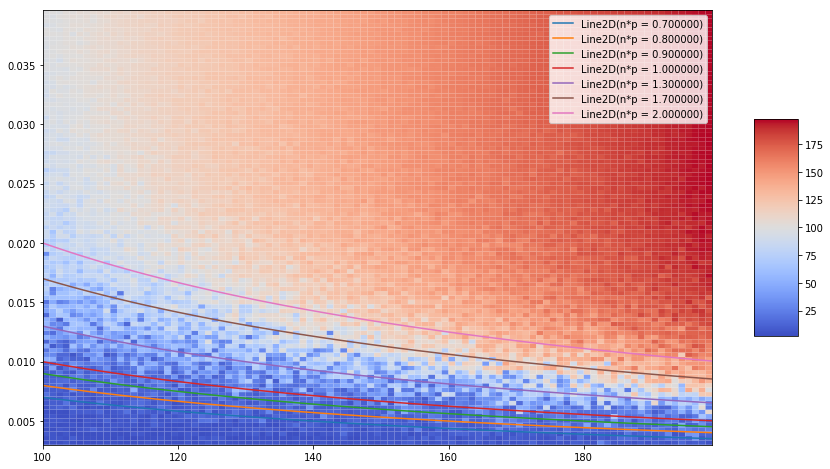

Assignment 2
============

Exercise 1.2
------------

The aim of this exercise is to show that graph generation methods obey
the theoretical degree distribution: P(k) =
C\_k\ :sup:`{n-1}p`\ k(1-p)^{n-k-1}.

In order to do that, we will do the following experiment - Generate a
random graph following Erdos-Renyi G(n=1000, p=0.65) model - We consider
all degrees and count how many times each degree appear - We obtain a
sample of size n for which we assume that it was generate by a binomial
distribution - Use Chi-square test to test our hypothesis

Generating sample
~~~~~~~~~~~~~~~~~

.. code:: ipython2

    import os, sys, math
    import collections as collcs
    # append the path so that modules can be properly imported
    sys.path.append('../src/')
    
    import graph
    import algorithms.erdos_renyi as er
    import algorithms.newman_model as nm
    
    reload(graph)
    reload(er)
    reload(nm)

.. parsed-literal::

    <module 'algorithms.newman_model' from '../src/algorithms/newman_model.pyc'>

.. code:: ipython2

    n, p, seed = 1000, 0.4, 12345
    G = er.er_np(n, p, seed=seed)
    m = (n*(n-1)/2.0)*p
    m = int(math.floor(m))
    G1 = er.er_nm(n, m)

Processing sample
~~~~~~~~~~~~~~~~~

Now we will count how many times each number from the set
:math:`\{1,\dots,n-1\}` appears.

.. code:: ipython2

    g_degree_sequence = G.degree_sequence()
    g1_degree_sequence = G1.degree_sequence()
    num_counter, num_counterG1 = {}, {}
    for i in range(n):
        num_counter[i] = num_counterG1[i] = 0
    
    for d1, d2 in zip(g_degree_sequence, g1_degree_sequence):
        num_counter[d1] += 1
        num_counterG1[d2] += 1

Chi-square test
~~~~~~~~~~~~~~~

A description of chi-square test can be found on the following
`link <https://en.wikipedia.org/wiki/Chi-squared_test>`__.

In order to do the chi-squared test, we will need: - observed number of
appearing of each number in our sample (*num\_counter*) - expected
number of observations: we will get this by computing probability for
each number and multiplying with number of samples

*Note*: In the next block of code, we will use python modules **scipy,
numpy** and **matplotlib**.

Let's firstly draw a histogram of binomial distribution with parameters
*n* and *p*.

.. code:: ipython2

    import scipy.stats as stat
    import numpy as np
    import matplotlib.pyplot as plt
    
    def plot_test(n, p, degree_sequence, counter, title="Plot"):
        # plot setup
        plt.figure(num=None, figsize=(15, 6), dpi=80, facecolor='white', edgecolor='green')
        
        # Binomial pmf with parameters n-1, p
        x_axis = np.linspace(0, n-1, n)
        y_axis = np.array([stat.binom.pmf(i, n-1, p) for i in range(n)]) #stat.binom.pmf(x_axis, n-1, p)
        # display degree distribution and binomial pmf
        #print("deg seq")
        #print(degree_sequence)
        my_counter, bins, patches = plt.hist(degree_sequence, x_axis, normed=1.0, edgecolor='k', linewidth=0.1)
        plt.title("Binomial distribution: n=%d, p=%f" % (n, p))
        plt.plot(x_axis, y_axis, 'r--', linewidth=1)
        plt.grid(True)
        plt.axis([0, n-1, 0, 0.3])
        plt.show()
    
    # compute observed and expected
        observed = np.array([counter[i] for i in range(n)]) # fix this.
        expected = y_axis * n  #we multiply it by number of observations
    
    # do the test
        chi, p_value = stat.chisquare(observed, expected, ddof=n-1)
        print("Chi-value: %f, p-value: %f" % (chi, p_value))
        
    # G(n, p) model
    plot_test(n, p, g_degree_sequence, num_counter, title="Plot2")
    print("******************Second test*******************")
    num_counterG1[0]=0
    plot_test(n, p, g1_degree_sequence, num_counterG1, title="Plot1")

.. parsed-literal::

    /home/vladan/.local/lib/python2.7/site-packages/scipy/stats/stats.py:4544: RuntimeWarning: invalid value encountered in true_divide
      terms = (f_obs - f_exp)**2 / f_exp

.. parsed-literal::

    Chi-value: nan, p-value: nan
    ******************Second test*******************

.. parsed-literal::

    Chi-value: nan, p-value: nan

In the above figure, we see that degree sequence looks very similar to
binomial pmf. Also, *p-value* of our test is 1.0 which gives a strong
evidence in a favour of the null hypothesis, i.e., degree sequence was
generated by a binomial distribution.

Exercise 2
----------

In this exercise, we want to demonstrate the following: - if
:math:`np < 1`, a graph in :math:`G_{n,p}` will almost surely have no
connected components of size larger than :math:`O(\log n)` - if
:math:`np = 1`, a graph in :math:`G_{n,p}` will almost surely have a
largest component whose size is :math:`O(n^\frac{2}{3})`, - if
:math:`np \to c > 1`, where c is a constant, then a graph in
:math:`G_{n,p}` will almost surely have a unique giant component
containing a positive fraction of the vertices. No other component will
contain more than :math:`O(\log n)` vertices. Furthermore, - if
:math:`np < (1 − \epsilon)\log n`, a graph in :math:`G_{n,p}` will
almost surely contain isolated vertices, and - if
:math:`np > (1 + \epsilon)\log n`, a graph in :math:`G_{n,p}` will
almost surely be connected.

To do so, we will do the following experiments.

.. code:: ipython2

    from mpl_toolkits.mplot3d import Axes3D
    from matplotlib import cm
    from matplotlib.ticker import LinearLocator, FormatStrFormatter
    import numpy as np
    import matplotlib.pyplot as plt
    
    def component_experiment((n_l, n_r), (p_l, p_r), seeds = None, offset = 3):
        # n_l, n_r bounds for n
        # p_l, p_r bounds for probability
        # s sample size
        # generate s graphs from G(n,p)
        s = n_r - n_l # sample size
        if seeds is None:
            seeds = np.random.choice(2000000, s*s).reshape((s, s))
        # compute
        
        step_p = float(p_r - p_l) / float(s)
        
        N = np.arange(n_l, n_r, step=1)
        P = np.arange(p_l, p_r, step=step_p)
        
        N, P = np.meshgrid(N, P)
        CC = np.zeros((s, s))
        # r_graphs = []
        for i in range(s):
            # r_graphs.append([])
            for j in range(s):
                G = er.er_np(int(N[i, j]), P[i, j], seed=seeds[i, j])
                # r_graphs[-1].append(G)
                cc_sizes = G.connected_component()[1]
                
                # get the largest
                largest_comp_size = 0 if len(cc_sizes) == 0 else max(cc_sizes)
                # print("Largest comp of graph (%d, %f) is %d" % (int(N[i, j]), P[i, j], largest_comp_size))
                CC[i, j] = largest_comp_size
        
        plot3D(N, P, CC)
            
            
    
    def plot3D(X, Y, Z):
        # plt.figure(num=None, figsize=(15, 6), dpi=80, facecolor='w', edgecolor='k')
        fig = plt.figure(figsize=(15, 8))
        mapa = plt.pcolor(X, Y, Z, cmap=cm.coolwarm, antialiased=True)
        fig.colorbar(mapa, shrink=0.5, aspect=5)
        
        # plot a few lines
        tX = X[1]
        n_times_p = [0.7, 0.8, 0.9, 1.0, 1.3, 1.7, 2.0]
        lines = []
        for prod in n_times_p:
            line, = plt.plot(tX, prod / tX, label="n*p = %f"%prod)
            lines.append(line)
        
        plt.legend(lines)
        
        plt.show()
        
    component_experiment((100, 150), (0.005, 0.05))

In the above graph, :math:`x`-axis represents number of nodes our graph
has, :math:`y`-axis is probability :math:`p`. We plot different lines as
a function of :math:`n` and :math:`p`. More precisely, we plot 7 lines
with :math:`n\cdot p \in \{.7, .8, .9, 1.0, 1.3, 1.7, 2.0\}`. We can see
that when :math:`n\cdot p < 1`, the size of the largest component is
below 20 (with a few exceptions). This confirms that if :math:`np < 1`
then the size of the largest component belongs to :math:`O(\log n)`.
From the other side, if :math:`np = 1` (the red line), we see that the
size of the largest component is between :math:`20` and :math:`60`.
Again, this is a good evidence that the size of the largest component is
of order :math:`O(n^{\frac{2}{3}})`.

One of the things that can be seen in the above plot is that there is a
sharp threshold for the size of largest component. Although it is not
true that the threshold is :math:`np = 1`, we can see that the threshold
line satisfies :math:`np = c`. Thus, increasing :math:`n` should solve
this.

Finally, let us try to estimate number of isolated vertices.

.. code:: ipython2

    # number of isolated vertices when np in [(1-e)logn, (1+e)logn] for n in [100, 200] and p in [0.02, 0.5]
    
    n_l, n_r = 100, 150
    p_l, p_r = 0.0001, 0.05
    epsilon = np.concatenate((np.linspace(-0.2, 0.0, 4), np.linspace(0.01, 0.15, 3)))
    p_size = n_size = int(n_r - n_l)
    N, P = np.linspace(n_l, n_r, n_size), np.linspace(p_l, p_r, p_size)
    
    N, P = np.meshgrid(N, P)
    CC = np.zeros((n_size, p_size))
    
    for i in range(n_size):
        for j in range(p_size):
            G = er.er_np(int(N[i, j]), P[i, j])
            isolated_vertices = G.find_isolated_vertices()
            CC[i, j] = len(isolated_vertices)
    
    fig = plt.figure(figsize=(15, 8))
    mapa = plt.pcolor(N, P, CC, cmap=cm.coolwarm, antialiased=True)
    fig.colorbar(mapa, shrink=0.5, aspect=5)
    
    X = N[0]
    lines = []
    for prod in epsilon:
        line, = plt.plot(X, ((1+prod)*np.log(X))/X, label="n*p = %flog(n)"%(1+prod))
        lines.append(line)
    
    plt.legend(lines)
    
    plt.show()

.. image:: output_11_0.png

The above plot represents the number of isolated vertices as a function
of :math:`n` and :math:`p`. We also see 7 lines representing equations
:math:`n\cdot p = (1+\epsilon)\log(n)` for
:math:`\epsilon \in [-0.2, 0.15]`.

We can observe the follwoing: - when :math:`n\cdot p > 1.15\log(n)`
(everything above the pink line), there is no isolated vertices - when
:math:`n\cdot p < 0.8\log(n)` (everything below the blue line), we see
that almost all graphs have at least one isolated vertex
