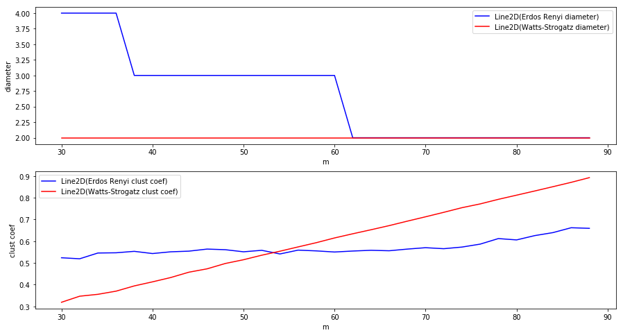
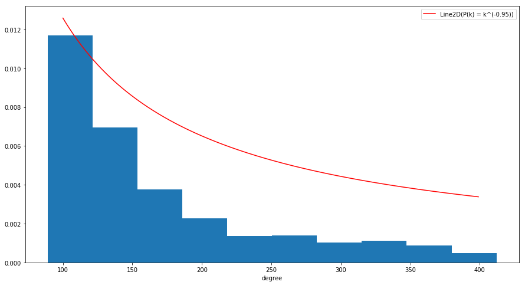

Assignment 3
============

Problem 1
---------

The goal of this exercise is to compare clustering coefficient and the
length of shorthest path of Watts-Strogatz model with Erdos-Renyi model.
To do so, we will create multiple instances of Watts-Strogatz model with
:math:`N=100` vertices and different values for :math:`k`. Similarly, we
will generate multiple instances of ER model with :math:`N=100` and
:math:`m = \frac{k\cdot N}{2}`.

Firstly, we will import the necessary packages.

.. code:: ipython2

    import sys, os
    sys.path.insert(0, '../src/')
    import algorithms.watts_strogatz as ws
    import algorithms.erdos_renyi as er
    import numpy as np
    import matplotlib.pyplot as plt

.. code:: ipython2

    N, beta = 100, 0.5
    K = np.arange(30, 90, 2)
    er_graphs = []
    ws_graphs = []
    for k in K:
        m = k*N // 2
        ws_graphs.append(er.er_nm(N, m))
        er_graphs.append(ws.watts_strogatz(N, k, beta, seed=1234))

Now we will make two different plots. In one, we will compare the
diameters of the above generated graphs and in the second one, we will
compare clustering coefficient.

.. code:: ipython2

    # on x axis, plot k
    # on y axis, plot the diameter
    ws_diam, er_diam, ws_cc, er_cc = [], [], [], []
    
    for g1, g2 in zip(ws_graphs, er_graphs):
        ws_cc.append(g1.global_clustering_coefficient())
        paths = g1.shortest_path()
        max_path = [[(0 if np.isinf(paths[u][v]) else paths[u][v]) for v in g1.vertices()] for u in g1.vertices()]
        ws_diam.append(max(max(max_path)))
        er_diam.append(g2.diameter())
        er_cc.append(g2.global_clustering_coefficient())

.. code:: ipython2

    fig = plt.figure(figsize = (15, 8))
    plt.subplot(211)
    er_line, = plt.plot(K, er_diam, 'b', label="Erdos Renyi diameter")
    ws_line, = plt.plot(K, ws_diam, 'r', label="Watts-Strogatz diameter")
    plt.legend([er_line, ws_line])
    plt.xlabel("m")
    plt.ylabel("diameter")
    
    
    plt.subplot(212)
    cc_er_line, = plt.plot(K, er_cc, 'b', label="Erdos Renyi clust coef")
    cc_ws_line, = plt.plot(K, ws_cc, 'r', label="Watts-Strogatz clust coef")
    plt.legend([cc_er_line, cc_ws_line])
    plt.xlabel("m")
    plt.ylabel("clust coef")
    
    plt.show()

As we can see from the above plots, graphs following BA model have
approximately the same diameter as ER graphs while the clustering
coefficient is increased.

Problem 2
---------

The goal of this exercise is to show that Barabasi-Albert model produces
a scale free network. To do that, we will generate a random graph
following BA model and compute the degree distribution. Then, we will
try to approximate the obtained distribution with power law
distribution.

.. code:: ipython2

    import algorithms.barabasi_albert as ba
    reload(ba)
    N, m, gamma = 1000, 100, -2
    M = np.arange(90, 150)
    
    g = ba.barabasi_albert(N, m)
    
    # ba_graphs = [ba.barabasi_albert(N, m) for m in M]

.. code:: ipython2

    gamma = -0.95
    fig = plt.figure(figsize=(15, 8))
    degree_seq = np.array(g.degree_sequence(), dtype=np.float32)
    degree_dist = degree_seq / sum(degree_seq)
    plt.hist(degree_seq, normed=True)
    degree_range = np.arange(100, 400, dtype=np.float32)
    p_law = [k**gamma for k in degree_range]
    pl_line, = plt.plot(degree_range, p_law, 'r-', label="P(k) = k^(-0.95)")
    plt.legend([pl_line])
    plt.xlabel("degree")
    
    plt.show()

